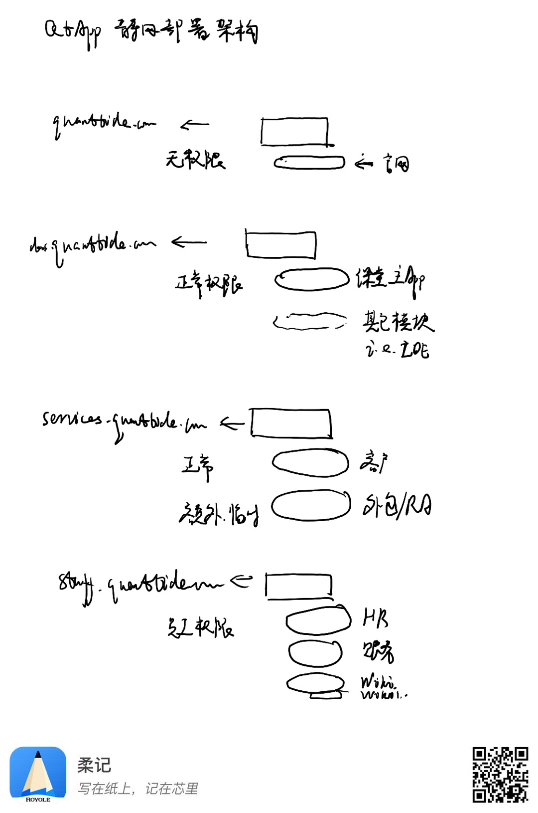

# 静态网站托管

部署在腾讯云对象存储，通过手动配置静态网站。

## 存储桶

命名规范为`<service>-web-<env>`，比如`qtclass-web-prod`。由于存储桶名称限制在20个以内，因此环境变量使用缩写`dev`、`test`、`prod`，或者`d`、`t`、`p`。

创建存储桶以后，打开静态网站设置，如果有必要则打开自定义源站域名和自定义CDN域名。

## 域名

### 一级域名

- quanttide.com用于生产环境。
- quanttidetech.com用于预生产环境。
- 开发环境使用默认域名。

### 二级域名

- <hostname>用于企业官网。
- class.<hostname>用于课程平台（量潮课堂APP）。
- services.<hostname>用于数据服务平台（量潮数据服务APP）。
- admin.<hostname>用于内部管理平台（量潮企业后台APP）。

## 部署规则

## 日志投递

每个环境一个固定存储桶，命名规范为`qtapps-web-<env>`，比如`qtapps-web-prod`。

存储桶内以应用隔离文件夹，以应用标识为文件夹名称，如`qtclass`、`qtadmin`。
