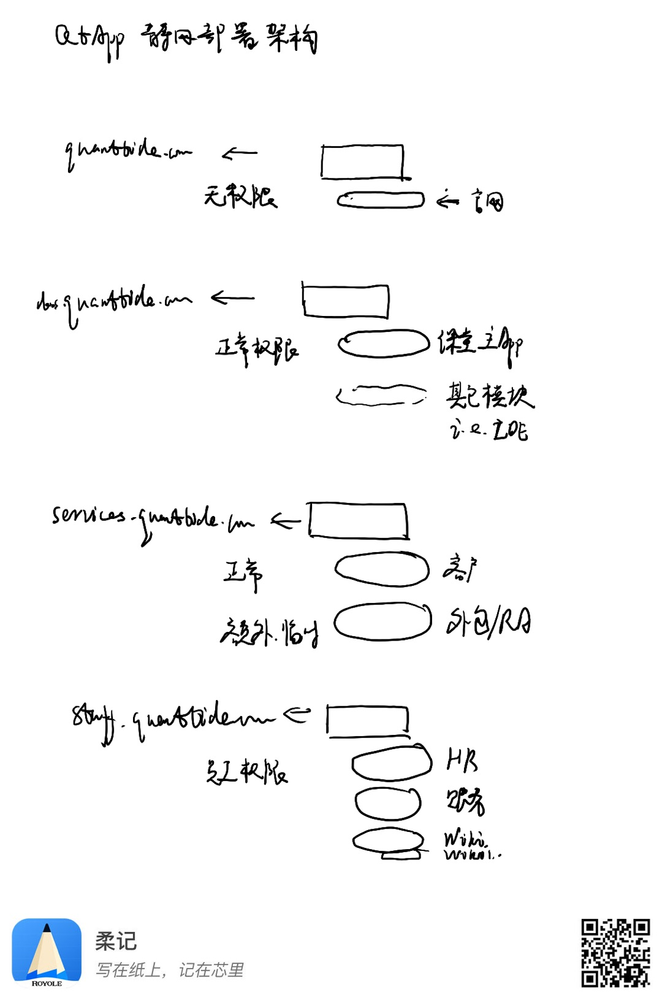

# 静态网站托管

部署在云平台对象存储，通过手动配置静态网站。

## 存储桶

命名规范为`<service>-web-<env>`，比如`qtclass-web-prod`。由于存储桶名称限制在20个以内，因此环境变量使用缩写`dev`、`test`、`prod`，或者`d`、`t`、`p`。

创建存储桶以后，打开静态网站设置，如果有必要则打开自定义源站域名和自定义CDN域名。

## 域名

### 一级域名

- quanttide.com用于生产环境。
- quanttidetech.com用于预生产环境。
- 开发环境使用云平台默认域名。

### 二级域名

- <hostname>用于企业官网（site 用主域名）。
- class.<hostname>用于课程平台（量潮课堂APP）。
- services.<hostname>用于数据服务平台（量潮数据服务APP）。
- admin.<hostname>用于内部管理平台（量潮企业后台APP）。

### 前端应用域名规则（2026-08-12 果总决策）

**一域名、一存储桶、一前端应用一一对应**：前端客户端统一用 `studio.<hostname>` 子域名。

- `studio.class.quanttide.com`：课程平台客户端（qtclass studio）
- `studio.delib.cloud.quanttide.com`：议事云客户端（qtcloud-delib studio）
- 其余应用客户端同理（`studio.<应用主域名>`）

即：应用主域名（如 class.quanttide.com）承载站点/服务端入口，`studio.` 前缀承载该应用的前端应用。

### 已分配域名

- 管理后台客户端：`admin.quanttide.com`
- 管理后台服务端：`api.admin.quanttide.com`
- 课程平台客户端：`studio.class.quanttide.com`
- 系统级 API 网关：`api.quanttide.com`

## 部署规则

## 日志投递

每个环境一个固定存储桶，命名规范为`qtapps-web-<env>`，比如`qtapps-web-prod`。

存储桶内以应用隔离文件夹，以应用标识为文件夹名称，如`qtclass`、`qtadmin`。
